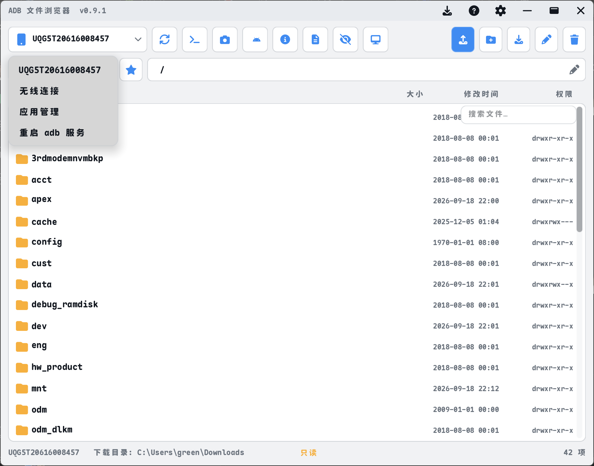

# ADB 文件浏览器（AdbTools）

一个基于 [EUI-NEO](https://github.com/sudoevolve/EUI-NEO) 框架、用 C++17 编写的 **Android ADB 文件管理器 + 工具箱**。自带设备文件浏览、上传/下载、截图、APK 安装、应用管理、实时 logcat、scrcpy 投屏，以及 adb / scrcpy 的版本检测与一键更新。

- 界面：自绘无边框窗口 + 圆角 + 深色/浅色主题 + 自定义主题色 + 字体/字号/缩放设置
- 平台：Windows 10/11（MinGW-w64 编译）

---

## 截图

主界面（浅色主题）：



---

## 功能特性

- **设备管理**：自动探测 adb（SDK / PATH / 程序目录），列出并选择连接的设备，断线自动检测
- **文件管理**：浏览设备文件系统、多选、上传/下载、重命名、删除、新建文件夹、复制/移动（设备内剪贴板）、拖拽上传
- **路径导航**：可编辑路径栏、目录自动补全、后退/前进、快捷路径（书签）、显示隐藏文件、按名称/大小/日期排序
- **常用命令**：内置「adb shell」与「宿主命令」两类常用命令，可自定义增删
- **截图 / 安装 APK / 设备信息 / 无线连接**
- **应用管理**：列出第三方应用、卸载、清除数据
- **文本 / 图片预览**：直接预览设备上的文本和图片
- **实时 logcat**：持续滚动、默认清空历史、大小写不敏感的正则过滤
- **scrcpy 投屏**：内嵌到独立手机样式窗口，圆角、主题联动、窗口大小记忆
- **更新检测**：检测并一键更新 adb（Google 官方源）与 scrcpy（GitHub 官方源）
- **个性化**：深色/浅色主题、6 种主题色、系统字体/字重/字号、界面缩放（含动画）

---

## 下载与安装

到 [Releases](../../releases) 页面下载，有两种选择：

- **安装版**：`AdbTools-Setup-*.exe` —— 双击运行安装向导，自动创建开始菜单快捷方式（可选桌面快捷方式），并附带卸载程序。安装到用户目录（`%LOCALAPPDATA%\Programs\AdbTools`），无需管理员权限。
- **便携版**：`AdbFileBrowser-windows-x64.zip` —— 解压后双击 `adb_browser.exe` 即可运行，无需安装。

便携版解压后的目录结构：

```
AdbFileBrowser-windows-x64/
├── adb_browser.exe        # 主程序
├── assets/                # 界面字体 / 图标字体
└── scrcpy/                # 内置 scrcpy.exe、adb.exe、scrcpy-server 及依赖 DLL
```

运行前提：

1. Windows 10/11；
2. 手机开启「开发者选项 → USB 调试」，用数据线连接电脑并授权；
3. 也可以使用无线调试（`adb connect <IP>:<端口>`）。

> 说明：程序会自动寻找 adb。若你已安装 Android SDK / platform-tools，会优先使用系统中的 adb；否则使用内置在 `scrcpy/` 里的 adb。

---

## 关于数字签名（本软件未签名）

**当前发布的版本没有数字签名**，因此：

- Windows 可能显示「未知发布者」，SmartScreen 可能提示"已阻止"；
- 个别杀毒软件可能误报（原因和解决办法见下方「杀毒软件报毒怎么办」）。

这是**已知且预期**的情况，不是程序有问题。代码签名证书需要付费或有资格门槛（开源项目证书只能签发给法律实体），本项目目前不打算引入签名；如果你介意这一点，可以从源码自行编译（见下方「从源码编译」），或按下方说明把程序加入杀软白名单。

**隐私政策**：本程序**不会**在未经用户明确要求的情况下向任何联网系统传输信息。所有网络访问都只在你主动操作时发生：检查/执行 adb、scrcpy、本软件的更新（访问 Google 官方仓库与 GitHub Releases），以及你自己触发的下载。第三方组件的隐私政策请参见各自项目主页（[scrcpy](https://github.com/Genymobile/scrcpy)、[Android SDK Platform-Tools](https://developer.android.com/tools/releases/platform-tools)）。

---

## 从源码编译

### 依赖

- [MinGW-w64](https://www.mingw-w64.org/)（GCC **12 或更新**，含 `mingw32-make`）；推荐 [WinLibs](https://winlibs.com/) 或 MSYS2
- [CMake](https://cmake.org/) 3.14+
- Git

### 编译步骤

```bash
# 1. 克隆仓库
git clone --recursive https://github.com/joffeego/AdbTools.git
cd AdbTools

# 2. 配置（生成 MinGW Makefiles）
cmake -S . -B build -G "MinGW Makefiles" -DCMAKE_BUILD_TYPE=Release

# 3. 编译（并行）
cmake --build build --parallel
```

编译产物为 `build/adb_browser.exe`，字体资源会自动拷贝到 `build/assets/`。

> `3rd/EUI-NEO/` 是**已随仓库一起分发的框架源码**（含本项目的少量定制修改），CMake 使用 `EUI_DEPS_MODE=bundled` 全离线编译，不需要联网拉取依赖。

### 运行

```bash
# 直接运行（会使用 PATH / SDK 中的 adb；若无则用内置 adb）
./build/adb_browser.exe

# 若要把内置 scrcpy/adb 放到程序目录（投屏与 adb 探测需要）：
./scripts/fetch_scrcpy.ps1 -Version latest -OutDir build/scrcpy
```

---

## 目录结构

```
AdbTools/
├── main.cpp                # 界面与交互（GUI 层）
├── core/                   # 纯逻辑（无 UI 依赖，有单元测试）——见 core/README.md
├── tests/                  # core 的单元测试（ctest，无第三方框架）
├── regex_wrap.cpp          # std::regex 的异常隔离封装（logcat 过滤用）
├── adb_browser.rc          # Windows 资源脚本（版本信息 + 内嵌 manifest）
├── adb_browser.manifest    # 应用清单（asInvoker / longPathAware）
├── CMakeLists.txt          # 构建脚本
├── LICENSE                 # Apache-2.0
├── THIRD_PARTY_NOTICES.md  # 第三方组件与许可
├── scripts/
│   └── fetch_scrcpy.ps1    # 下载并解压 scrcpy（内含 adb）
├── screenshots/            # README 截图
├── .github/workflows/      # CI（构建 + 单元测试）与发版
└── 3rd/EUI-NEO/            # 框架源码（bundled，含少量定制修改）
```

### 架构：`main.cpp` 与 `core/`

**`core/` 里只放纯逻辑**：没有 UI、没有全局状态、没有平台头文件。这条规则由 CI 强制检查（`core-purity` job），不是靠自觉。

这样做有两个直接好处：

1. **能写单元测试** —— 版本比较、更新包的 JSON/XML 解析、sha256 校验文件解析、原子写文件等，全部可以脱离界面验证；
2. **能查出真 bug** —— 补测试的过程里立刻暴露了 3 个问题：`parseSize()` 会接受负数、`adbShortVersion()` 大小写敏感导致漏读真实 adb 输出、以及更新 sidecar 回退路径以前从未被验证过。

运行测试：

```bash
cmake --build build --parallel
cd build && ctest --output-on-failure
# 或直接看每个用例： ./adbtools_tests.exe
```

新增代码时：纯逻辑放 `core/`（并补测试），界面相关放 `main.cpp`。判断标准很简单 —— **如果一个函数需要"应用上下文"才能工作，它还不适合进 core，先拆分**。

---

## 更新机制

「检查更新」对话框（标题栏最左侧下载图标）会检测并更新三样东西：

- **本软件**：从你配置的 GitHub 仓库 `releases/latest` 获取最新版本，点击「更新到 X」会下载、解压并替换 `adb_browser.exe`（更新完成后重启生效）。下载的升级包会先与 Release 公布的 **SHA-256** 校验值比对，不一致就中止安装；
- **adb**：从 Google 官方仓库 `dl.google.com/.../repository2-1.xml` 解析最新 platform-tools 版本（同时读取官方公布的校验值和准确的 Windows 包地址）；
- **scrcpy**：从 GitHub Releases API 获取最新版本，并校验发布方公布的 SHA-256（更新前会先关闭投屏释放文件占用）。

> 📌 **发版时同步版本号**：`kAppUpdateRepo` 已指向本仓库 `joffeego/AdbTools`，自更新地址无需再改；
> 每次发版需要同步改三处版本号：`main.cpp` 的 `kAppVersion`、`adb_browser.rc` 的 `FILEVERSION/PRODUCTVERSION` 及版本字符串、`installer.iss` 的 `MyAppVersion`。提交后打 `vX.Y.Z` 标签推送即可自动发版（CI 会在 Release 里附带每个安装包的 `.sha256` 校验文件）。
>
> 若网络无法访问 GitHub，对应行会显示「最新版本：未知」，不影响其它项。

---

## 杀毒软件报毒 / 被防火墙拦截怎么办？

本程序**没有数字签名**，并且会做一些本身合法、但容易被启发式规则误判的行为（调用 `adb.exe` / `scrcpy.exe` 子进程、联网下载更新包、替换自身的 exe 文件）。因此 Windows Defender 或第三方杀软**可能把安装包或主程序报成「木马 / 病毒」**，这是**误报（false positive）**，不是程序真的有毒。

遇到这种情况，可以按下面任一种方式处理：

1. **给文件加白名单**：Windows 安全中心 →「病毒和威胁防护」→「管理设置」→「排除项」→ 添加排除项，选择解压后的程序目录（或 `AdbTools-Setup-*.exe`）。
2. **提交误报给微软**（最彻底，24–48 小时内会更新特征库）：打开 <https://www.microsoft.com/en-us/wdsi/filesubmission>，选择 “Software developer” → 上传被报毒的文件 → 提交为 **Incorrectly detected / 误报**。
3. **第三方杀软**（火绒 / 360 / 卡巴斯基等）一般也有「误报反馈」入口，把文件提交过去即可。
4. **先自己核对文件完整性**：Release 里每个安装包都附带 `.sha256` 校验文件，可用下面的命令核对下载到的文件有没有被篡改或下载不完整：

   ```powershell
   Get-FileHash .\AdbFileBrowser-windows-x64.zip -Algorithm SHA256
   Get-Content .\AdbFileBrowser-windows-x64.zip.sha256   # 两者的哈希应完全一致
   ```

如果你会自己编译，也可以从源码构建（见下方「从源码编译」），这样得到的 exe 与你本地环境一致，能进一步排除「下载被人替换」的疑虑。

---

## 快捷键

| 按键 | 功能 |
| --- | --- |
| F5 | 刷新当前目录 |
| F2 | 重命名 |
| Backspace | 返回上级目录 |
| Enter | 进入选中的文件夹 |
| Delete | 删除选中项 |
| Ctrl+L | 编辑路径 |
| Esc | 关闭当前弹窗 |

---

## 第三方组件与许可

本软件以 **Apache License 2.0** 开源。它使用了以下第三方组件（详见 [THIRD_PARTY_NOTICES.md](THIRD_PARTY_NOTICES.md)）：

- [EUI-NEO](https://github.com/sudoevolve/EUI-NEO)（Apache-2.0）—— UI 框架
- [scrcpy](https://github.com/Genymobile/scrcpy)（Apache-2.0）—— 投屏（运行时下载，不随源码分发）
- [Android SDK Platform-Tools (adb)](https://developer.android.com/tools/releases/platform-tools)（Apache-2.0）—— 调试桥（运行时下载，不随源码分发）
- 字体：Font Awesome 7 Free、JingNanJunJunTi、YouSheBiaoTiHei

---

## 免责声明

本项目仅供学习与合法的设备调试使用。请勿将其用于违反相关法律法规或侵犯他人权益的用途。使用本软件产生的一切后果由使用者自行承担。
